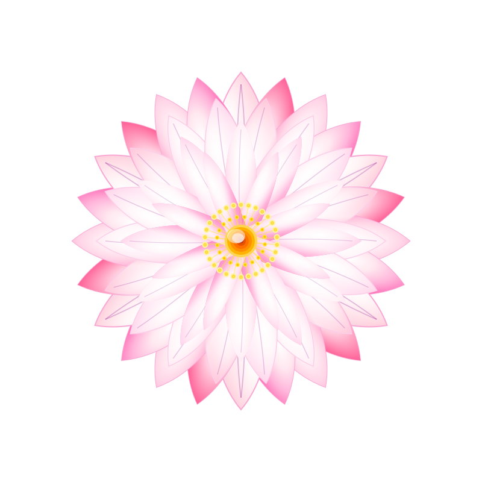

<table>
<tr>
<td valign="top" width="60%">

### 🎯 Recent Achievements

**🏆 Major Wins**
- 🥇 **1st Place** - SpiritX 2025 Inter-University Competition
- 🏆 **Web App Excellence Award** - Idealize 2025 *(Best Web App)*
- 🥈 **2nd Place** - FIT CodeRush 2024 Hackathon
- 🥈 **2nd Place** - Idealize 2025 Datathon *(Lung Cancer ML)*
- 🥈 **2nd Place** - Idealize 2025 Web App Competition
- 🥉 **3rd Place** - Devthon 2.0 Web Development
- 🥉 **3rd Place** - AWS Cloud Ideathon

### 🎓 Certifications
- 🎖️ Microsoft Certified: Fabric Analytics Engineer Associate
</td>
<td valign="middle" align="right" width="40%">

</td>
</tr>
</table>
